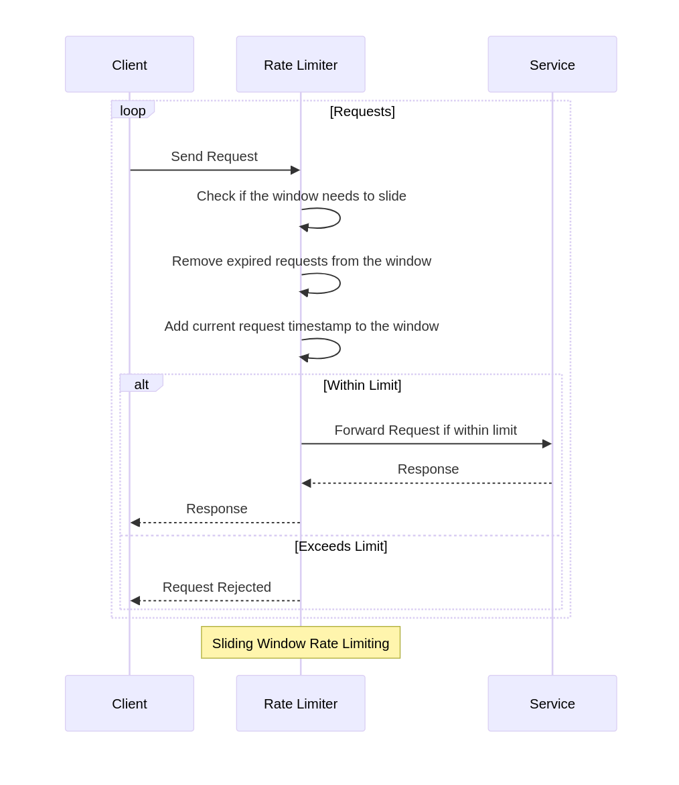
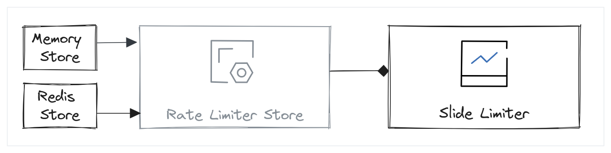

# **Slide Limiter**

A TypeScript implementation of a sliding window rate limiting algorithm that provides rate limiting functionality using different storage mechanisms, including in-memory storage and Redis. It allows you to limit the number of requests or actions that can be performed within a specific time window for a given key or identifier.

[](https://nodejs.org)
[](https://www.npmjs.com/package/slide-limiter)
[](https://github.com/m-elbably/slide-limiter/workflows/slide-limiter/badge.svg)
[](https://coveralls.io/github/m-elbably/slide-limiter?branch=main)
[](https://raw.githubusercontent.com/m-elbably/slide-limiter/master/LICENSE)

## Table of Contents

- [Introduction](#introduction)
- [Features](#features)
- [Installation](#installation)
- [Sliding Window Algorithm](#sliding-window-rate-limiting-algorithm)
- [Usage](#usage)
- [Notes](#notes)
- [License](#license)

## Introduction

Rate limiting is a common technique used in software systems to control the rate at which requests are made. This sliding window rate limiter allows you to restrict the number of requests within a specified time window for a particular key or client.

## Features

- Sliding window rate limiting algorithm.
- Dynamic rate limiting.
- In-memory store for tracking requests.
- Advanced Redis store implementation with automatic expiration and cleanup.
- Easily extendable for different stores.

## Installation

You can install slide limiter using npm:

```bash
npm install slide-limiter
# OR
yarn add slide-limiter
```

## Sliding Window Rate Limiting Algorithm

The Sliding Window Algorithm is a time-based method used to track and control the rate at which requests or operations can be made within a specific time window. It's a dynamic system that adapts to changing traffic patterns, making it an effective tool for rate limiting in various applications.

The central concept behind the Sliding Window Algorithm is the utilization of a dynamic time window that moves with the flow of time. Unlike static methods that reset rate limits at fixed intervals, the sliding window continuously adjusts to the current time, allowing for a more flexible and adaptable approach.



The diagram depicts a sequence of events for handling incoming requests:

1. **Client** initiates requests to access a service.
2. These requests are intercepted by the **Rate Limiter** to ensure they comply with the defined rate limit.
3. Within each request the following actions occur:
    - The **Rate Limiter** checks if the sliding window needs to be adjusted. This is a crucial aspect of sliding window rate limiting. The window slides over time to maintain the rate limit.
    - Expired requests that fall outside the sliding window are removed from consideration.
    - The timestamp of the current request is added to the sliding window, indicating its occurrence.
4. Each request has two scenarios according to window limit:
    - **Within Limit:** If the current request rate is within the defined limit, the **Rate Limiter** forwards the request to the **Service**. The **Service** processes the request and sends a response back to the **Rate Limiter**, which, in turn, forwards the response to the **Client**.
    - **Exceeds Limit:** If the current request rate exceeds the defined limit, the **Rate Limiter** responds to the **Client** with a request rejection, indicating that the limit has been exceeded.
5. The process continues in a loop for incoming requests.

### The Benefits of the Sliding Window Algorithm

The Sliding Window Algorithm offers several advantages, including:

1. **Flexibility**: It adapts to varying traffic patterns and prevents abrupt cutoffs when rate limits are exceeded.
2. **Efficiency**: By focusing on a dynamic time window, it optimizes resource usage, avoiding unnecessary restrictions during periods of low traffic.
3. **Fairness**: The algorithm ensures that resources are allocated fairly, preventing any single client or user from monopolizing them.
4. **Protection**: It safeguards against abuse, ensuring that the system remains secure and available even in the face of excessive traffic.

## Usage
Here's how you can use slide limiter in your project:

```typescript
import { MemoryStore, SlideLimiter } from "slite-limiter";

// Create a MemoryStore instance
const store = new MemoryStore();
// Create a SlideLimiter instance with options
const options = {
  windowMs: 60000, // 1 minute
  maxLimit: 10,
};

const limiter = new SlideLimiter(store, options);

// Perform a rate-limited action
const bucket = 'users';
const key = "user123";
const remainingRequests = await limiter.hit(bucket, key);

if (remainingRequests > 0) {
  // Allow the action
  console.log(`Action performed. Remaining requests: ${remainingRequests}`);
} else {
  // Rate limit exceeded
  console.log("Rate limit exceeded. Please try again later.");
}
```
Default values for `windowMs` and `maxLimit` defined in the SlideLimiter options, but you have the flexibility to change these parameters on a per-request basis. This means that for a specific request, you can override the default values of `windowMs` and `maxLimit` by passing custom values for these parameters when you call the `hit` method.

Dynamic rate limiting is beneficial when you have different rate limiting requirements for various operations or clients. For example, you might want to allow a higher rate limit for certain premium users or reduce the rate limit for specific resource-intensive operations. Instead of creating a new rate limiter instance for each of these scenarios, you can simply adjust the parameters on the fly when making a rate-limited request.

### Hits Counting

`async hit(bucket: string, key: string, options: WindowOptions): Promise<number>`
>`options` parameter is optional, rate limiter options will be used as default

1. **`bucket`**: The `bucket` parameter is a higher-level categorization that allows you to group rate limits for different resources or endpoints. It can be used to separate the count for specific endpoints or functionalities within your application. In the context of a web API, for example, you might want to rate limit different endpoints differently. By using a `bucket`, you can create distinct rate limits for different parts of your application. For instance, you could have separate `buckets` for `/users/auth`, `/api/orders`, and `/api/profile`, each with its own rate limit configuration.
2. **`key`**: The `key` parameter represents the identifier for the resource or entity you want to rate limit. It is typically associated with a specific user, IP address, or any other unique identifier for the client making the request. For example, if you want to rate limit requests from different users or clients separately, you can use the user's ID or IP address as the `key`. The `key` is an essential part of the rate limiting process because it allows you to track and limit requests on a per-client basis.
3. **`windowMs`**: The `windowMs` parameter represents the time window (in milliseconds) during which rate limiting is applied. It defines the period over which requests are counted and limited. Any requests made within this time window are considered when enforcing rate limits. For example, if `windowMs` is set to 60000 (60 seconds), it means that the rate limiting applies to requests made within the last minute.
4. **`maxLimit`**: The `maxLimit` parameter specifies the maximum number of requests that a client is allowed to make within the defined time window (`windowMs`). It is the threshold beyond which a client's requests will be rate-limited, meaning that they will be denied access until the rate limit resets.

>By using both the `bucket` and `key` parameters, you can achieve a flexible and effective rate limiting strategy that provides precise control over how different clients interact with various parts of your application.

**Advantages of Using `bucket`**:

- **Granular Control**: By using `buckets`, you can apply fine-grained rate limiting rules to different parts of your application. This allows you to prevent excessive requests to critical endpoints while being more permissive with less critical ones.
- **Isolation**: Rate limits for one `bucket` do not affect other `buckets`. This means that exceeding the limit for one endpoint (e.g., `/users/auth`) won't impact the rate limits for other endpoints (e.g., `/api/orders`).
- **Easy Configuration**: It's easier to manage and configure rate limits when they are organized by `buckets`. You can set specific limits for each `bucket` without needing to define separate `SlideLimiter` instances for each endpoint.
- **Scalability**: When your application grows, having `buckets` for different endpoints or features makes it easier to scale your rate limiting strategy. You can adapt the rate limits for specific `buckets` based on their importance and usage patterns.

### Storage Mechanisms
The library supports two built-in storage mechanisms:

#### MemoryStore
This stores rate limiting data in memory, making it suitable for single-server applications where rate limiting is local to that server.
`Very basic implementation`

#### RedisStore
This stores rate limiting data in a Redis database, which is suitable for distributed systems where rate limiting needs to be shared across multiple servers.



- `RateLimiterStore` is an abstract class that defines the basic structure of a rate limiter store.
- `MemoryStore` and `RedisStore` are concrete classes that inherit from Store and provide specific implementations.
- `SlideLimiter` is the main library class that uses a `RateLimiterStore` for rate limiting.

### How Redis Store Works

This Lua script is designed to be executed atomically in Redis, ensuring that rate limiting operations are consistent and thread-safe when multiple requests are made concurrently. It checks if the request count is within the defined limit and records each request's timestamp, allowing for accurate rate limiting enforcement.

```lua
    local current_time = redis.call('TIME')
    local bucket = KEYS[1]
    local id = KEYS[2]
    
    local key = bucket .. ":" .. id
    local window = tonumber(ARGV[1]) / 1000
    local limit = tonumber(ARGV[2])
    
    local trim_time = tonumber(current_time[1]) - window
    redis.call('ZREMRANGEBYSCORE', key, 0, trim_time)
    local request_count = redis.call('ZCARD', key)
    
    if request_count < limit then
      redis.call('ZADD', key, current_time[1], current_time[1] .. current_time[2])
      redis.call('EXPIRE', key, window)
      return limit - request_count - 1;
    end
    return 0
```
It performs the following steps:

1. **Get the Current Time**: Use `redis.call('TIME')` to retrieve the current time in Redis.
2. **Construct the Key**: Combine the `bucket` and `id` to create a unique key in Redis. This key represents the rate limiting window for a specific resource.
3. **Calculate the Time Window**: Convert the provided `windowMs` (in milliseconds) to seconds by dividing it by 1000.
4. **Check the Request Count**: Check the number of requests in the specified time window by using `redis.call('ZCARD', key)`. This count represents the requests made within the defined time window.
5. **Rate Limit Check**: If the request count is less than the `limit`, it means there's still capacity for more requests.
6. **Add Request Timestamp**: Add the current time to the Redis sorted set with the timestamp as the score. This effectively records the time of the request.
7. **Set Expiry Time**: Set an expiry time on the Redis key using `redis.call('EXPIRE', key, window)`. This ensures that rate limiting data is automatically cleared from Redis after the defined time window.
8. **Calculate Remaining Requests**: Calculate the remaining requests by subtracting the request count from the `limit` and then subtracting 1. This accounts for the current request.
9. **Return Remaining Requests**: Return the number of remaining requests. If it's greater than 0, the request is allowed; otherwise, it's rate-limited.

#### Using RedisStore (Redis) for rate limiting offers several benefits:

1. **Distributed and Scalable**: Redis is a distributed, in-memory data store that is well-suited for scaling applications. By using a `RedisStore`, you can implement rate limiting in a distributed system, making it easier to handle high traffic and load balancing across multiple instances.
2. **High-Performance**: Redis is known for its exceptional read and write performance, making it an excellent choice for rate limiting. It can quickly store and retrieve rate-limiting data, reducing the latency of rate limit checks.
3. **Expiration and Automatic Cleanup**: Redis allows you to set expiration times for keys, making it easy to implement automatic data cleanup. This feature is crucial for rate limiting because it ensures that old rate limit data is removed, maintaining the accuracy of the rate limiter.
4. **Atomic Operations**: Redis supports atomic operations, which means rate limit checks and updates can be performed atomically in a single step. This ensures that rate limiting operations are consistent, even in a multi-threaded or distributed environment.

## Notes

- This library is a low level implementation for "Sliding Window Rate Limiting Algorithm", it is not a middleware, you can use it to build your own middleware according to your needs.
- Beyond the Limit: Handling excess requests is your responsibility based on the hit remaining limit you may choose to throttle and/or drop requests.

## License
MIT

